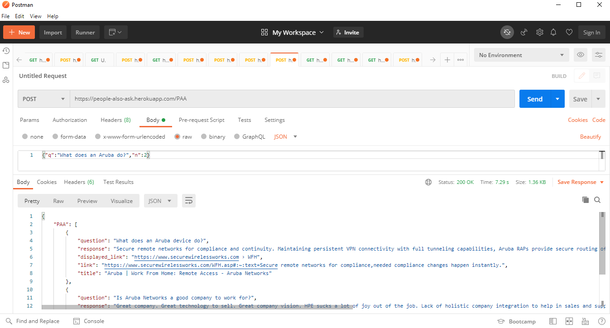

<div align="center">
<a href="https://github.com/ashishcssom/people-also-ask-API/stargazers"></a>
<a href="https://github.com/ashishcssom/Face_Mask_Detection_end_to_end_project/network/members"></a>
<a href="https://github.com/ashishcssom/Face_Mask_Detection_end_to_end_project/pulls"></a>
<a href="https://github.com/ashishcssom/Face_Mask_Detection_end_to_end_project/issues"></a>
<a href="https://github.com/ashishcssom/Face_Mask_Detection_end_to_end_project/graphs/contributors"></a>
</div>

     ____   ___   ____   ____   _      ___       _    _       ___   ____       _     ___   _  _  
    )  _)\ ) __( / __ \ )  _)\ ) |    ) __(     )_\  ) |     (  _( / __ \     )_\   (  _( ) |) / 
    | '__/ | _)  ))__(( | '__/ | (__  | _)     /( )\ | (__   _) \  ))__((    /( )\  _) \  | ( (  
    )_(    )___( \____/ )_(    )____( )___(   )_/ \_()____( )____) \____/   )_/ \_()____) )_|)_\ 

> Few days back, I worked on development of search engine for one of the organization, Idea was to build a search engine which can search on custom blob dataset like json, html, pdf, word and ppt files. After a research [Azure cognitive search](https://azure.microsoft.com/en-in/services/search/) perform the best to our case. But due to lack of dataset to create pipline or model to get `people also ask` feature like google and Bing, I was searching for options, then I come across one exciting library names [people_also_ask](https://github.com/lagranges/people_also_ask). This software is bulid on top of that to serve a purpose.

This application is free software to scrap the people also ask feature from google and serve as an API which can be utilized in any development/production search engines. This API is hosted on Heroku.



## Usage example

API support both **GET** and **POST** requests.

- `API url` :   https://people-also-ask.herokuapp.com/PAA
- `header`  :   {'content-type': 'application/json'}
- `body`    :   {"q":"What does an Aruba do?","n":2}

**Body description**

q : Search query

n : number of answers want in return

```python
import requests
import json
url = 'https://people-also-ask.herokuapp.com/PAA'
headers = {'content-type': 'application/json'}
query=json.dumps({"q":"What does an Aruba do?","n":2})
output = requests.post(url, data = query,verify=True,headers=headers)
```


## Release History

* 0.0.1
    * Work in progress

## Author

Ashish Kumar

Distributed under the XYZ license. See ``LICENSE`` for more information.

[](https://www.linkedin.com/in/ashishk766/) 
[](mailto:ashish.krb7@gmail.com) 

